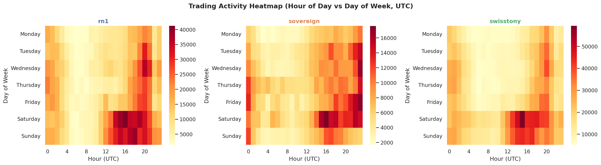
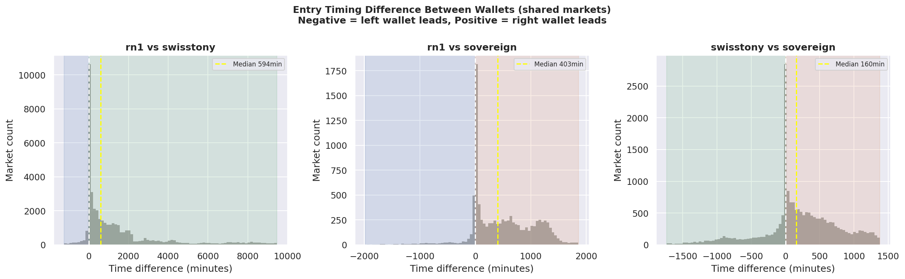
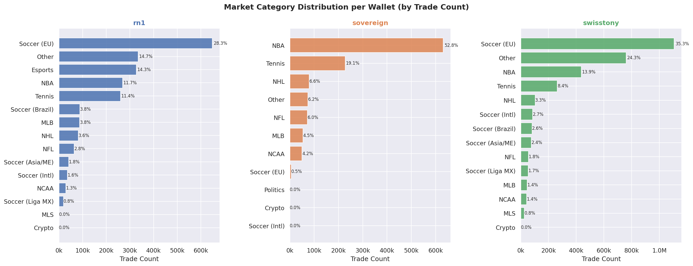
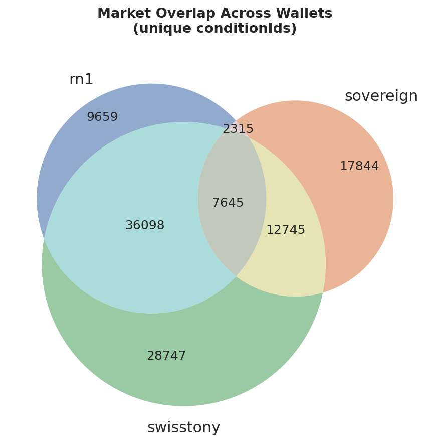
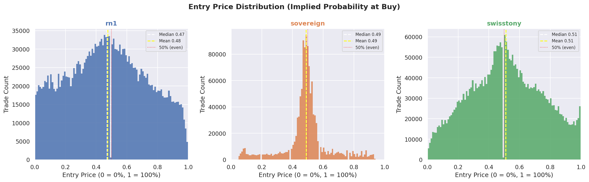
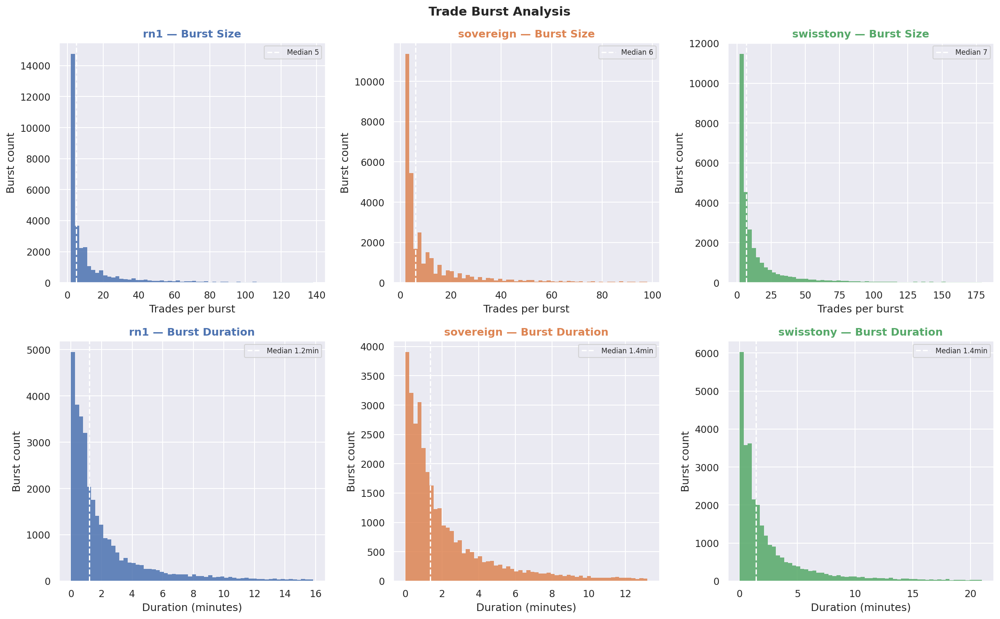
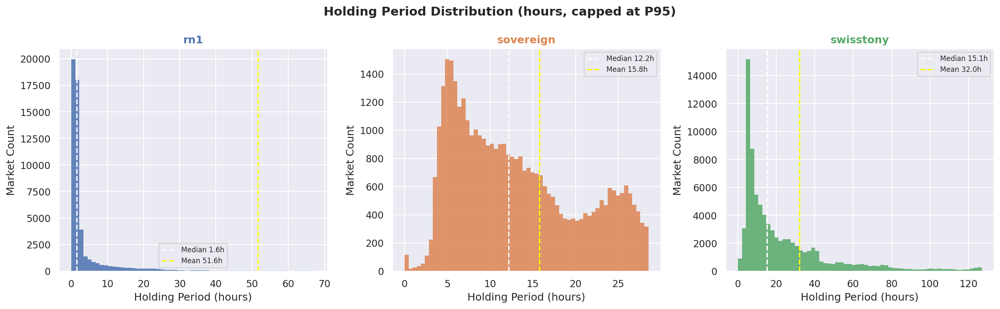
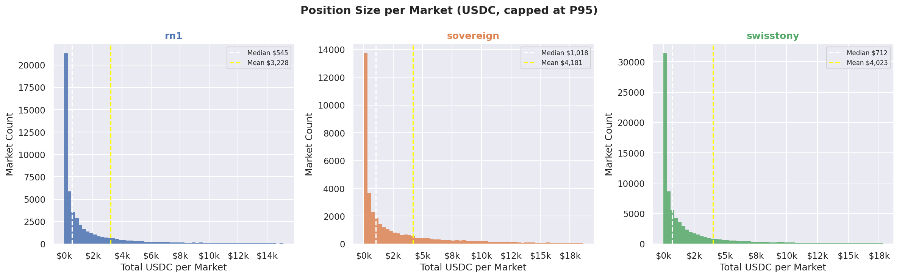

# Polymarket Smart Money Analysis
### Phase 1 — Smart Money Identification & Behavioral Analysis


> **A full-stack quantitative research pipeline** — from raw blockchain data ingestion to behavioral pattern extraction and copy trading signal evaluation — applied to three high-performing Polymarket wallets with a combined $80M+ monthly trading volume.

---

## Overview

This project is **Phase 1** of a larger proprietary prediction market trading system. The goal of this phase is to identify, profile, and reverse-engineer the strategies of the highest-performing wallets on Polymarket — the world's largest decentralized prediction market.

Rather than building models from scratch, the core thesis is: **if the best traders in a fully transparent onchain market can be systematically identified and their behavior modeled, their edge can be partially replicated through intelligent copy trading.**

Phase 1 answers three questions:
1. **Who** are the best wallets and what makes them high performers?
2. **What** are they doing — strategies, market preferences, sizing patterns?
3. **How** can they be copied — signal quality, timing windows, execution feasibility?

---

## Key Findings

> Full findings in [`docs/EXECUTIVE_SUMMARY.md`](docs/EXECUTIVE_SUMMARY.md)

- **6.8M+ onchain events** fetched and analyzed across 3 wallets spanning Aug 2025 → Apr 2026
- **Three completely distinct strategies** confirmed — NBA lines model (sovereign), EU football specialist (swisstony), global scanner (rn1)
- **99.99% BUY-only** — all three are automated bots, zero manual human trading pattern
- **Lead/follow hierarchy discovered:** sovereign leads rn1 and swisstony in 68–82% of shared markets, by a median of 160–400 minutes
- **Sovereign is the highest-quality copy signal** — 220 markets/day, stable entry prices (price std σ=0.03), 12h entry window, NBA O/U and spread specialist
- **swisstony is operationally uncopyable** — 498 markets/day median, peaks at 2,120/day
- **Burst behavior:** median burst is 5–7 trades over 60–90 seconds — copy protocol: detect first trade, place one proportional order, ignore the rest
- **82–87% of markets** entered via multiple DCA sessions across all three wallets
- **78.5% market overlap** between rn1 and swisstony — strong evidence of coordination or shared signal source

---

## Visual Highlights

| Hourly Activity Heatmap | Lead/Follow Timing |
|---|---|
|  |  |

| Market Category Distribution | Market Overlap (Venn) |
|---|---|
|  |  |

| Entry Price Distribution | Trade Burst Analysis |
|---|---|
|  |  |

| Holding Period | Position Sizing |
|---|---|
|  |  |

---

## Methodology

### Data Pipeline

```
Polymarket Data API (public, no auth)
      │
      ▼
notebooks/01_fetch.ipynb
  ├── Adaptive time-window chunked pagination
  ├── Recursive bisection for high-density windows
  ├── Per-window checkpointing (ledger.json)
  ├── Deduplication by transactionHash
  └── Parquet storage (fastparquet)
      │
      ▼
data/activity_{wallet}.parquet   (~890 MB total, gitignored)
      │
      ▼
notebooks/02_analysis.ipynb
  ├── Section 1 — Data quality & validation
  ├── Section 2 — Event type deep dive
  ├── Section 3 — Resolve logic (activity-derived)
  ├── Section 4 — Performance metrics [deferred — see plan/]
  ├── Section 5 — Behavioral analysis
  ├── Section 6 — Strategy reverse engineering
  └── Section 7 — Cross-wallet comparison + copy signal evaluation
```

### Engineering Highlights

**Resumable backfill with adaptive bisection** — the Polymarket Data API hard-caps pagination at offset 3,500. For wallets trading 2,000+ events per hour, standard pagination fails. The fetch pipeline solves this with weekly time windows that recursively bisect into hourly (or sub-hourly) chunks when density overflows the cap — fully resumable via a JSON ledger checkpoint file.

**Python 3.14 + pandas 2.x compatibility** — pandas 3.0 defaults to Arrow-backed strings which fastparquet cannot serialize. Fixed globally via `pd.options.future.infer_string = False` before any DataFrame operations.

**15-category market classifier** — rule-based keyword classifier covering NBA, NFL, MLB, NHL, Tennis, Soccer (EU/Brazil/Asia/Intl/Liga MX), Esports, NCAA, MLS, Crypto, Politics — achieving 82% coverage across 29,000+ unique market titles with zero ML overhead.

---

## Target Wallets

| Label | Address | Portfolio Value | Monthly Volume |
|---|---|---|---|
| `rn1` | `0x2005d16a84ceefa912d4e380cd32e7ff827875ea` | $402k | ~$40M |
| `sovereign` | `0xee613b3fc183ee44f9da9c05f53e2da107e3debf` | $105k | ~$30M |
| `swisstony` | `0x204f72f35326db932158cba6adff0b9a1da95e14` | $210k | ~$80M |

All wallets selected from Polymarket leaderboard based on consistent cumulative PnL growth, high win rate, and no detectable gambling behavior (no martingale sizing, no all-in positions, diversified market exposure).

---

## Project Structure

```
polymarket-smart-money/
├── notebooks/
│   ├── 01_fetch.ipynb          # Data ingestion pipeline
│   └── 02_analysis.ipynb       # Full EDA and behavioral analysis
├── docs/
│   ├── EXECUTIVE_SUMMARY.md    # Research findings memo
│   ├── 01_fetch.html           # Rendered notebook (no setup needed)
│   └── 02_analysis.html        # Rendered notebook (no setup needed)
├── plan/
│   ├── PERFORMANCE_METRICS_PLAN.md   # Deferred — requires Gamma API
│   └── DEFERRED_TIER2_TIER3.md       # Kelly, liquidity, drawdown analysis
├── plots/                      # All generated visualizations (committed)
├── data/                       # Gitignored — regenerate via 01_fetch.ipynb
│   ├── activity_{wallet}.parquet
│   ├── positions_{wallet}.csv
│   └── ledger.json
├── .gitignore
├── CHANGELOG.md
├── requirements.txt
└── README.md
```

---

## Setup & Reproduction

```bash
# Clone
git clone https://github.com/darrnhard/polymarket-smart-money
cd polymarket-smart-money

# Create environment
python -m venv venv
source venv/bin/activate        # macOS/Linux
pip install -r requirements.txt

# Fetch data (takes ~15–30 minutes, ~890 MB total)
jupyter notebook notebooks/01_fetch.ipynb

# Run analysis (requires data/ to be populated first)
jupyter notebook notebooks/02_analysis.ipynb
```

**Note:** `data/` is gitignored. Run `01_fetch.ipynb` from top to bottom to regenerate all parquet files. The ledger checkpoint system makes it resumable — safe to interrupt and restart at any point.

**Tip:** Rendered HTML versions of both notebooks are available in `docs/` — view the full analysis with all outputs without running anything.

---

## Data Sources

| API | Base URL | Purpose | Auth |
|---|---|---|---|
| Data API | `data-api.polymarket.com` | Wallet activity, positions, trades | None |
| Gamma API | `gamma-api.polymarket.com` | Market metadata, resolution status | None |

All data is publicly available onchain (Polygon blockchain) and via Polymarket's public REST APIs. No authentication or API keys required for any data used in this project.

---

## Roadmap

This project is under active development. Phase 1 (this repository) is complete.

| Phase | Description | Status |
|---|---|---|
| 1 — Analysis | Smart money identification, behavioral profiling, strategy reverse engineering | ✅ Complete |
| 2 — Execution | Copy trading bot, real-time wallet monitoring, order execution engine | 🔄 In Progress |
| 3 — Optimization | Performance metrics, Kelly sizing, live strategy refinement | 📋 Planned |

Phase 2 will build directly on the copy signal hierarchy established here — sovereign as primary signal source, swisstony as confirmation filter, 60–90 second burst window for execution.

---

## Limitations

**Performance metrics are deferred** — win rate, realized PnL, Sortino, and Calmar require market resolution data from the Gamma API. The resolve logic built from activity data alone misclassifies ~99% of markets as OPEN due to Polymarket's auto-redemption behavior (winning positions are redeemed automatically without generating REDEEM events in the activity log). See [`plan/PERFORMANCE_METRICS_PLAN.md`](plan/PERFORMANCE_METRICS_PLAN.md) for the full implementation plan.

**Market classifier coverage** — 18% of trades fall into the "Other" category representing ~29,000 unique market titles across obscure global leagues. This is genuine long-tail data, not a classification failure.

---

## Tech Stack

`Python 3.14` · `pandas 2.x` · `fastparquet` · `plotly` · `seaborn` · `matplotlib` · `requests` · `matplotlib-venn` · `Jupyter`

---

## License

MIT — free to use, fork, and build on. Attribution appreciated.

---

*Built by [@darrnhard](https://github.com/darrnhard)*
